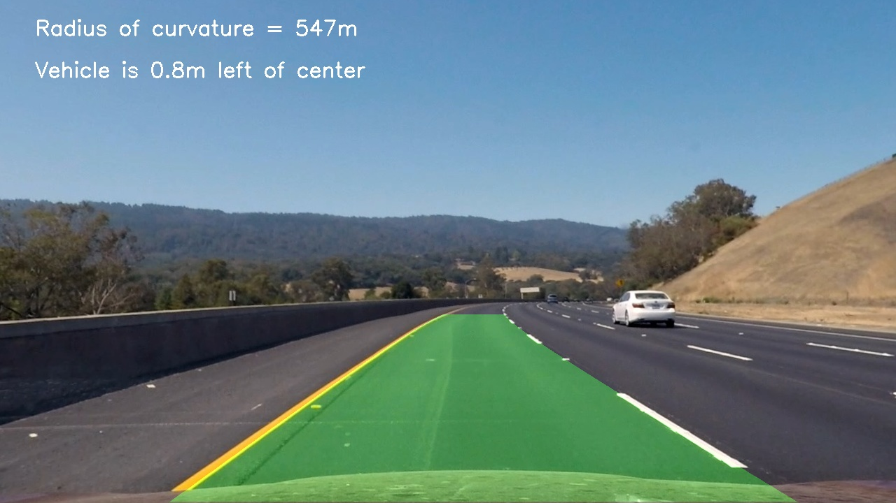

## Advanced Lane Finding
[](http://www.udacity.com/drive)


In this project, the goal is to write a software pipeline to identify the lane boundaries in an 
image as shown in the example above. The details about the entire pipeline is given below with
pointers to specific section of the code and intermediate outputs.

The Project
---


The goals / steps of this project are the following:

* Compute the camera calibration matrix and distortion coefficients given a set of chessboard images.
* Apply a distortion correction to raw images.
* Use color transforms, gradients, etc., to create a thresholded binary image.
* Apply a perspective transform to rectify binary image ("birds-eye view").
* Detect lane pixels and fit to find the lane boundary.
* Determine the curvature of the lane and vehicle position with respect to center.
* Warp the detected lane boundaries back onto the original image.
* Output visual display of the lane boundaries and numerical estimation of lane curvature and vehicle position.

[//]: # "Image References"

[image1]: ./media/examples/undistort_output.png "Undistorted"
[image2]: ./media/test_images/test3.jpg "Road Transformed"
[image3]: ./media/examples/binary_warp_test3.jpg "Binary Example"
[image4]: ./media/examples/perspective_test3.jpg "Warp Example"
[image5]: ./media/examples/poly_fit_test3.png "Fit Visual"
[image6]: ./media/examples/result_test3.jpg "Output"
[image7]: ./media/examples/undist_test3.jpg "Undistorted test image"
[image8]: ./media/examples/histogram.png	"Histogram"

## [Rubric](https://review.udacity.com/#!/rubrics/571/view) Points

### Here I will consider the rubric points individually and describe how I addressed each point in my implementation.  

---

### Camera Calibration

#### 1. Briefly state how you computed the camera matrix and distortion coefficients. Provide an example of a distortion corrected calibration image.

The code for this step is contained in the function `calibrate_camera` belonging to the file `calibration.py.` I first choose a chessboard as the object to calibrate my camera with and define the number of corners lying in a row and a column, 9 and 6 respectively. Then, I prepare the "object points", which would be the (X, Y, Z) coordinates of the corners of the chessboard in the world. The underlying assumption is that the chessboard is fixed on the plane (Z = 0). The same object points, `objp`, are used for all of the calibration images, which makes the array `objpoints`. After that, I create the array `imgpoints` by stacking the (x, y) pixel positions of the detected chessboard corners of each image. Finally, I used the output `objpoints` and `imgpoints` to compute the camera calibration and distortion coefficients using the `cv2.calibrateCamera()` function. I applied this distortion correction to the test image using the `cv2.undistort()` function and obtained this result: 

![alt text][image1]

### Pipeline (single images)

I show the intermediate outputs of each stage in the pipeline. The example input image used here is shown below:

![alt text][image2]

#### 1. Example of a distortion-corrected image.

To demonstrate this step, I will describe how I apply the distortion correction to one of the test images like this one:

![alt text][image7]


#### 2.  Perspective transform to create a bird-eye's view

The code for my perspective transform resides in the 1st and 2nd block under the heading **Perspective Transform** in the notebook `Advance-Lane-Lines.ipynb`.  After carefully observation, I hardcoded the source and destination points to be used for the transform.

```python
src = np.float32([
    [img_size[1] // 2 - 60, img_size[0] - 270],
    [img_size[1] // 2 + 80, img_size[0] - 270],
    [30, img_size[0]],
    [img_size[1], img_size[0]]
])

dst = np.float32([
    [0, 0],
    [img_size[1], 0],
    [0, img_size[0]],
    [img_size[1], img_size[0]]
])
```

This resulted in the following source and destination points:

|          Source          | Destination |
| :----------------------: | :---------: |
|   580, 450 (top left)    |    0, 0     |
|   720, 450 (top right)   |  1200, 720  |
|  30, 720 (bottom left)   |   0, 720    |
| 1200, 720 (bottom right) |   1200, 0   |

I verified that my perspective transform was working as expected by drawing the `src` points onto a test image (marked in red `x`) and its warped counterpart to verify that the lines appear parallel in the warped image.

![alt text][image4]

#### 3. Creating a thresholded binary image

I used a combination of color and gradient thresholds to generate a binary image (the various thresholding functions can be found in `thresh_utils.py`).  Apart from the HLS and RGB transforms discussed in the course, I also explored the LAB transform, where B stands for the blue-green color space. After several trial and errors, I finally used a combination of thresholds on the L-channel, B-channel and the magnitude of the Sobel gradient in the x-direction. This can be seen in the 4th block under the heading **Color/transform based threshold** in the notebook `Advance-Lane-Lines.ipynb`. The thresholds were chosen such that there is either large amount of yellow or (notice the binary operator being used) high brightness or a high gradient magnitude using the Sobel filters in the x-direction.

![alt text][image3]

#### 4. Identifying lane-line pixels and fitting their positions with a polynomial

For this step, I used a sliding window approach. First, I compute the histogram of values across the width of the binary warped image from the previous step, summed over its height. I observe two peaks in the histogram, corresponding to the two lane lines. 

![alt text][image8]

Then, I consider a window (100, here) around both the peaks and search for non-zero pixels. If the number of pixels in this window is more than a threshold (50, here), I recompute the base position (which was the peak found earlier) as the mean of these non-zero pixels. I keep doing this until the entire height of the image is covered. This gives me a list of non-zero pixel positions for each of the lane lines, marked in yellow and blue respectively. Then, I fit two polymonials to these pixel positions separately, representing the two lane lines (marked in red). Also, once we have computed this, for the next frame (in the case of videos),  we don't need to redo the sliding window step. We can use that as a prior and search around the earlier obtained fit within a margin. The margin that we'd search for in this fit is shown as the green region in the image below.

The majority code for this section resides in the file `lane_utils.py` which gets used by the notebook `Advance-Lane-Lines.ipynb` under the heading **Fitting polynomials to the Lane Lines**.

![alt text][image5]

#### 5. Radius of curvature of the lane and the position of the vehicle with respect to center

I did this in the function `measure_curvature_pixels` in the file `lane_utils.py`. The function requires as input the left and right fits scaled to the real-world values, which is obtained by the function `get_scaled_fits` belonging to the same file. The meter value per pixel for the x and y directions is set in the notebook `Advance-Lane-Lines.ipynb` in the 3rd block under the heading **Fitting polynomials to the Lane Lines**. The value is chosen keeping in mind that we use 720 pixels in the y-direction and (roughly) 900 pixels in the x-direction. The distance to the center is calculated by first finding out the bottom most point of each detected lane line using the corresponding fits at `y = img_size[0]`. The distance of their center from the center of the image is the final output. Both the radius of curvature and the distance to the center is annotated on the resulting image. 

#### 6. Example result on the test image

The code for the complete pipeline, that brings in all the separate components in one place, can be found under the heading **Pipeline** in the notebook `Advance-Lane-Lines.ipynb`. I use two `Line` objects, `left_line` and `right_line`, which store intermediate values like the line being already detected, all past fits, etc. for both the lane lines, to be used when working with a video. Nevertheless, the implementation requires an initialization where all the values of the object need to be initialized (reset). That is done by the lines: `left_line.reset()` and `right_lines.reset()` in the code referred earlier.

![alt text][image6]

---

### Pipeline (video)

#### 1. Link to your final video output. 

Here's a [link to my video result](./media/test_videos_output/project_video_output.mp4). A critical part for the pipeline to work with videos are the `Line` objects. Both the objects are reset beforehand. After every detection for a frame, we first do a sanity check as to whether the detected lines are valid or not by checking if they are parallel and whether their distances to the center are same or not. If they are, we consider them as a valid detection and add the corresponding X to a queue containing the past n (=10 for us) X fits. An average of these n fits is used to make the final result. In case the detected lane lines are not valid, we reset the queue and use the average fit calculate for the previous frame. Also, instead of performing a sliding window search for each frame, we use a valid detection as the prior for searching and search only around a margin of that prior. 

---

### Discussion

#### 1. Briefly discuss any problems / issues you faced in your implementation of this project.  Where will your pipeline likely fail?  What could you do to make it more robust?

There were a few steps that were particularly challenging, the major one being finding the optimal way to obtain the thresholded image - having a wide range of choices being a leading cause for this. Also, the perspective transform step requires the selection of source and destination points, which can have several choices. One could select exactly the region belonging to the lane lines and warp it such that the portion lies somewhere in the middle of the image (as was the default in this doc). The other approach (that I took) was to consider some padding around the exact lane line and warp the entire portion (including the padded area) to the corners of the image. There was no clear winner and I proceeded with whatever ended up working well for me. This is also a potential area of failure. Since these values are hardcoded, having any other type of view, where the roads appearing different, would cause the algorithm to fail. Also, the calibration of images was done using a specific type of chessboard orientation that might not work with a different type of camera. A more robust calibration technique would allow the transfer of this method across different camera images. The sliding window technique takes a lot of time (when working with a video specially), so making that faster is one more area of improvement. If I were to continue working on this project, I would definitely try the approach of framing this as a Semantic Segmentation problem and use a Fully Convolutional Network (like U-Net/PSPNet/DeepLab). The major benefit here being that deep networks have been shown to be much more robust to changes in lighting conditions, shadows, etc.
